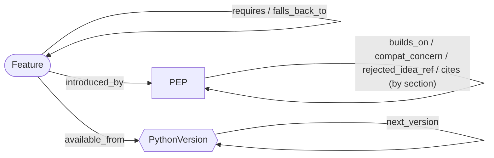
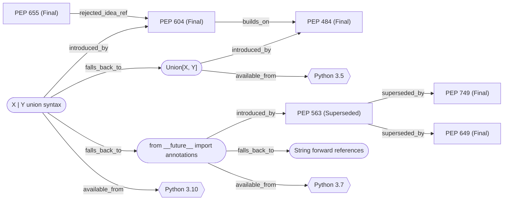

# Typing PEP Knowledge Graph

A knowledge graph of Python's 49 typing PEPs that answers one practical question for a team:

> "We run Python **X**. We want to use these typing features. Which can we use, what do we write instead, what are the risks, and why was each feature designed this way?"

You give it a Python version and a plain description of the typing features you plan to use. It walks a graph of PEPs, features, and Python versions and returns a structured report: a verdict per feature, the minimum Python version, the fallback path if the feature is not available, risk flags, the design reasoning from the PEP itself, an upgrade path, and the graph edges behind every claim.

See [approach.md](approach.md) for why it is built this way.

## What the graph looks like

The schema: three node types and the typed edges between them.



A real slice of the knowledge state, generated from `knowledge_state/graph.json`. This is the part the system walks when a team on Python 3.9 asks about `X | None`: the feature needs 3.10, so it falls back to `Union[X, Y]`. The other fallback, `from __future__ import annotations`, carries a risk because PEP 563 was superseded.



The full graph (104 nodes, 315 edges) is in `knowledge_state/graph.json`; `knowledge_state/SUMMARY.md` shows it as tables.

## Repository layout

```
ingest/parse_peps.py        Stage 1: raw extraction from the PEP .rst files (headers, section tree, PEP mentions)
kg/schema.py                The schema: node types, edge types, section-to-edge rules, status risks
kg/feature_catalog.json     Hand-curated typing features: introducing PEP, aliases, requires, fallbacks
kg/build_graph.py           Stage 2: applies the schema, writes the knowledge state
knowledge_state/graph.json  The knowledge state (nodes + typed edges + schema + counts)
knowledge_state/SUMMARY.md  Readable view of the same knowledge state
reasoner/engine.py          Reasoning over the graph for a new input
cli.py                      Testable interface
tests/test_engine.py        Behavioural tests
scripts/rebuild.sh          Clone the PEPs repo at a pinned commit and rebuild everything
```

## Install

Python 3.8 or newer. The system itself uses only the standard library.

```bash
git clone <this repo>
cd <this repo>
pip install -r requirements.txt   # only needed to run the tests
```

## Run it on a new input

The knowledge state is committed, so this works immediately after cloning:

```bash
python cli.py --python 3.9 --want "X | None unions, TypedDict with optional keys, Protocol, and the type statement"
```

Useful options:

```bash
python cli.py --python 3.9 --want "..." --json       # full structured report as JSON
python cli.py --python 3.9 --want "..." --evidence   # show the graph edges behind each verdict
python cli.py --list-features                        # the vocabulary the input is matched against
python cli.py                                        # interactive: prompts for version and description
```

More inputs to try:

```bash
python cli.py --python 3.8  --want "deferred annotations and Self"
python cli.py --python 3.11 --want "@override, TypeIs, ReadOnly keys"
python cli.py --python 3.12 --want "arrow callable syntax and inline typeddict"
python cli.py --python 3.9  --want "def f(x: list[int] | None)"   # features written as code
python cli.py --python 3.11.9 --want "X|None"                     # patch versions are accepted
```

## Rebuild the knowledge state

```bash
bash scripts/rebuild.sh                  # pinned PEPs commit, reproducible
PEPS_REF=main bash scripts/rebuild.sh    # rebuild against the latest PEPs
```

On Windows use Git Bash. If your interpreter is not called `python`, set it: `PYTHON=py bash scripts/rebuild.sh`.

Manual equivalent:

```bash
git clone https://github.com/python/peps.git
python ingest/parse_peps.py --peps-dir peps/peps --out data/peps_raw.json
python kg/build_graph.py
```

## Tests

```bash
python -m pytest -q tests
```

## Configuration

No API keys and no network access at run time.

| Variable | Used by | Purpose |
|---|---|---|
| `PEPS_COMMIT` | `kg/build_graph.py` | Recorded in `graph.json` so the snapshot names its source commit |
| `PEPS_REF` | `scripts/rebuild.sh` | Which PEPs commit to build from (default: the pinned one) |
| `PYTHON` | `scripts/rebuild.sh` | Python interpreter to use (default: `python`) |
